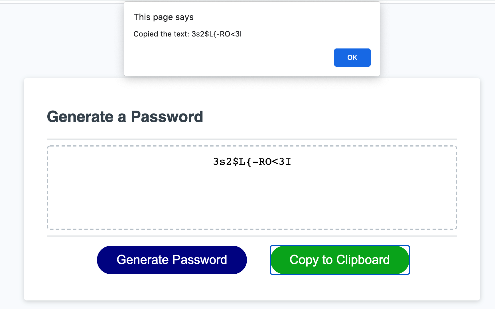

# Susan Fujii's JavaScript Strong Password Generator

## Table of Contents

- [Description](#Description)
- [Motivation and the Problem I am Solving](#Motivation-and-the-Problem-I-am-Solving)
- [Why I Built This](#Why-I-Built-This)
- [What I Learned](#What-I-Learned)
- [Installation](#Installation)
- [Usage](#Usage)
- [Screenshots](#Screenshots)
- [Credits](#Credits)
- [License](#License)
- [Features](#Features)
- [Contribute](#How-to-Contribute)

## Description

The purpose of this project is to **modify an existing website by creating an application that allows users to randomly generate a strong password** based on the criteria they've selected. The app runs in the browser and features dynamically updated HTML and CSS that is powered by JavaScript code. It has a clean, responsive user interface that adapts to multiple screen sizes. It allows the user to choose a desired password length of between 8 and 128 characters, and allows them to specify which characters they would like to include in their password (uppercase, lowercase, numeric, and special characters). 

### Motivation and the Problem I am Solving

More and more often today, users are expected to come up with unique secure passwords for each website on which they have an account. However, these websites often differ in their password selection criteria: some demand that users include special characters (a good practice), others will not let you enter special characters at all (not a good practice, but surprisingly common), some require lengths of at least 8 characters, some 12, some more...it becomes increasingly difficult for users to come up with passwords to satisfy all of these constantly-changing criteria.

### Why I Built This

So, enter the **Strong Password Generator**! With this tool, users can now quickly specify how long they would like their new password to be, which character sets to include, and then can quickly copy the newly generated password to the clipboard to use as they choose.

The entire process from clicking "Generate Password" to seeing and copying your brand-new password to the application of your choosing takes mere seconds and solves the problem of users having to struggle to "think" up lots of new strong passwords on their own. 

Additionally, this web application is **accessible** to users who will view it both on larger computer screens and also on smaller screen sizes, and the code is **up to current industry standards** and **uses best known practices**.

**Accessibility** is an increasingly important consideration. Web accessibility ensures that people with disabilities can access a website using assistive technologies like video captions, screen readers, and braille keyboards. **Accessible** sites also rank higher in search engines and ensure that **all** users can easily access the information provided.

### What I Learned

This was a challenging but fun project! I enjoyed wracking my brain to see how I could use logic to make the script work the way the "company" wanted it to work, and then re-wracking my brain to make my code better (extrapolating out repeated code into functions, etc.)-- I learned more and more with each go at it (and I'm sure could still improve!). I learned a ton about working with JavaScript arrays-- looping through them, methods you can use on them, and of course conditional logic and loops and also the event handlers for the buttons. I'd like to see if I can improve on this when we learn about different types of user input-- for example it would be awesome to have a checkbox feature where the user could just check the character sets he/she wants to include (rather than individually prompting for each one). Future goals!

## Installation
To view this project, simply visit (https://srfujii.github.io/Strong_Password_Generator/index.html)
 
To install this project on your local machine, simply visit this repo at (https://github.com/srfujii/Strong_Password_Generator) and use git to clone it to your local environment.

## Usage
This single-page website is very easy to navigate. Simply click on the Blue "Generate Password" button to start, answer a few short promts, and view your new randomly generated strong password in the text area box. To copy to your clipboard, simply click the "Copy to Clipboard" button and paste the result into an application or document of your choosing. That's it! 

The app will make sure to verify the length of your password (e.g. if you leave it blank or type "w" or other nonsense it will prompt you to try again using a valid number), and will check to make sure you've included at lease one character set (you cannot have a password with no characters!). 

## Screenshots
Here are some screenshots for you to preview how the password generator looks and feels:

### Password Generator UI:

## Credits

1. [Rice Technology Bootcamp](https://techbootcamps.rice.edu/)

### JavaScript Resources:

1. [Getting A Random Value from a JavaScript Array](https://stackoverflow.com/questions/4550505/getting-a-random-value-from-a-javascript-array)
2. [JavaScript parseInt() Function | MDN](https://developer.mozilla.org/en-US/docs/Web/JavaScript/Reference/Global_Objects/parseInt)
3. [JavaScript Array.push() Method](https://www.w3schools.com/jsref/jsref_push.asp)
4. [JavaScript Best Practices](https://www.w3schools.com/js/js_best_practices.asp)
5. [How to Unset JavaScript Variables](https://www.geeksforgeeks.org/how-to-unset-javascript-variables/)

### Favicon Resource:

1. [John Sorrentino's Old Key @ favicon.io](https://favicon.io/emoji-favicons/old-key)
2. [Keep favicons in root directory](https://stackoverflow.com/questions/5273103/any-problems-with-favicons-in-a-subfolder#:~:text=2%20Answers&text=Yes%2C%20some%20browsers%20start%20downloading,recognizes%20the%20icon%20is%20elsewhere)

## License
[MIT License](./license.txt)

## Features

<ol>
    <li>Semantic HTML implemented in HTML and CSS</li>
    <li>ELements follow logical structure</li>
    <li>Comments added before each CSS element and HTML section</li>
    <li>All buttons work</li>
    <li>Title is concise and descriptive</li>
    <li>When user clicks button to generate a password, he/she is presented with series of prompts for password criteria</li>
    <li>When user enters desired password length, application ensures user entered a number and that that number is between 8 and 128 characters</li>
    <li>User has ability to choose between lowercase, uppercase, numeric, and special characters, or any combination of the above</li>
    <li>Application ensures that user enters at least one valid character set</li>
    <li>When all prompts are answered, the password is generated that matches the user selected criteria</li>
    <li>The password is displayed on the webpage to the user in the text area so that it may be copied to the clipboard</li>
    <li>When the user clicks the "Copy to Clipboard" button the newly generated password is copied to the user's clipboard so that it may be used in other applications</li>
    <li>When the web application is resized or viewed on various screens and devices, the responsive layout adapts to the user's screensize</li>
    <li>Cute key favicon for window tab appearance</li>
    <li>Accessibility: button backgrounds change background color on mouseover/hover</li>
</ol>

## How to Contribute

